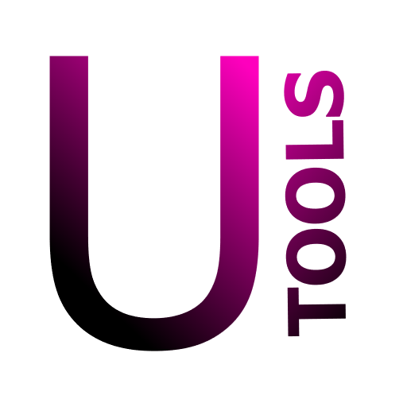
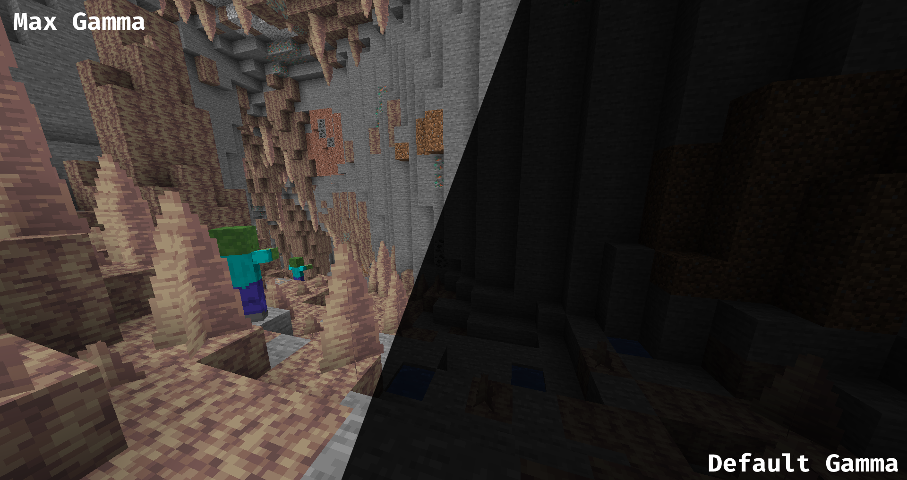

 

_Simple tools for the survival experience. This should act as a replacement to having tens of mods for things like Fullbright, Zoom etc._

# Features

## Fullbright / Gamma

Change your Gamma above the normal limits. The intended usage is to get Fullbright (Night Vision), but the Gamma can also be changed to a low value.

#### Usage

Use `/fullbright` or the `Toggle Fullbright` keybinding to switch between 1500% (Max) or 100% (Default) gamma.

Use `/fullbright [value]` to change your gamma to any positive value.!

You can toggle the normal / fullbright Gamma values in the settings (Accessible via [ModMenu](https://modrinth.com/mod/modmenu))

## Zoom

Zoom in (or out) with a simple hotkey.

#### Usage

Hold the `Zoom` keybinding to switch into zoom mode.

Change the zoom multiplier (how far it zooms in) in the settings.

# License

This project is licensed under [Creative Commons Attribution-NonCommercial 4.0 International](https://creativecommons.org/licenses/by-nc/4.0/deed.en).