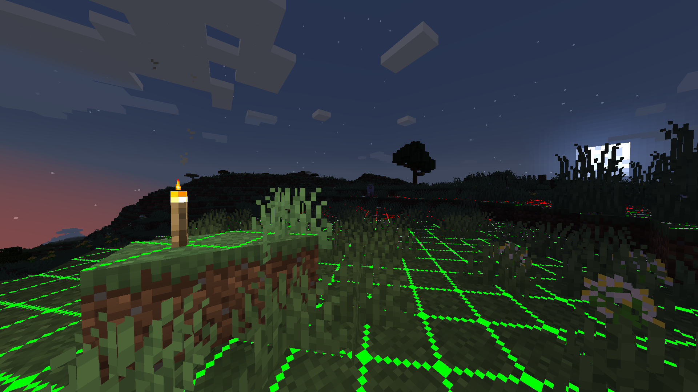

_Simple tools for the survival experience. This should act as a replacement to having tons of mods for things like Fullbright, Zoom etc._

# Features

## Fullbright / Gamma

Change your Gamma above the normal limits. The intended usage is to get Fullbright (Night Vision), but the Gamma can also be changed to a low value.

#### Usage

Use `/fullbright` or the `Toggle Fullbright` keybinding to switch between 1500% (Max) or 100% (Default) gamma.

Use `/fullbright [value]` to change your gamma to any positive value.!

You can toggle the normal / fullbright Gamma values in the settings (Accessible via [ModMenu](https://modrinth.com/mod/modmenu))

## Zoom

Zoom in (or out) with a simple hotkey. You can use a smooth zoom or an instant zoom.

#### Usage

Hold the `Zoom` keybinding to switch into zoom mode.

Change the zoom multiplier (how far it zooms in) in the settings.
To modify the zoom animation, change the `Zoom Speed` (Number from 0 to 1, 1 = Instant)

## Light Overlay

Display the light levels of nearby blocks in real-time. Useful to spawn-proof with torches.

#### Usage

Use the `Toggle Light Overlay` keybinding to toggle on or off. 

You can set the threshold for a green texture in the settings under `Light Overlay Threshold`.

## Client Time & Client Weather

Change your local time to `DAY,NOON,NIGHT,MIDNIGHT` and disable rain. This also works on servers since it is only client side.

#### Usage

You can change the time and weather in the settings (`/utools config` or in ModMenu).
Alternatively you can change the time with `/clienttime set day|noon|night|midnight` and reset with `/clienttime reset`.

## Unpin Texture Packs

This allows you to unpin all texture packs. Doing so, you can move all texture packs independent of their intended order. This is especially useful when a server forces a resource pack which you don't want. To bypass, you can just move the server pack to the bottom, below the default textures since it is no longer pinned.

#### Usage

The setting to unpin all packs is located in the settings (`/utools config` or via ModMenu)

## Copy Screenshots

When taking screenshots, the images will be automatically copied to the clipboard.

#### Usage

Toggleable in the settings

# Translations

`en_en` English: [@lugosieben](https://github.com/lugosieben) (Must be updated with any new feature!)

`de_de` German: [@Kolpixx](https://github.com/Kolpixx)

`es_es` Spanish: [@lugosieben](https://github.com/lugosieben)

# License

This project is licensed under [Creative Commons Attribution-NonCommercial 4.0 International](https://creativecommons.org/licenses/by-nc/4.0/deed.en).
